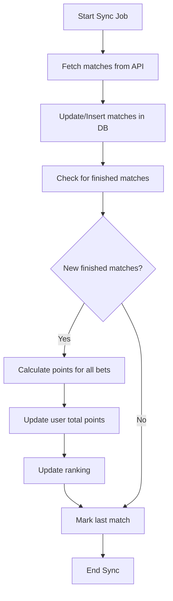

# 🏆 Bolão Copa - Implementation Plan

## Project Overview
Complete World Cup betting pool system with backend (FastAPI + Supabase) and frontend (React + Tailwind), deployable on Vercel.

**Target**: Up to 50 concurrent users
**Location**: `/Users/rodrigosposito/Desktop/bolao-copa`

---

## 📁 Project Structure

```
bolao-copa/
├── backend/
│   ├── app/
│   │   ├── __init__.py
│   │   ├── main.py                 # FastAPI app entry
│   │   ├── config.py               # Environment variables
│   │   ├── database.py             # Supabase connection
│   │   ├── models.py               # Pydantic models
│   │   ├── schemas.py              # Database schemas
│   │   ├── api/
│   │   │   ├── __init__.py
│   │   │   ├── users.py            # User endpoints
│   │   │   ├── matches.py          # Match endpoints
│   │   │   ├── bets.py             # Betting endpoints
│   │   │   ├── admin.py            # Admin endpoints
│   │   │   └── ranking.py          # Ranking endpoints
│   │   ├── services/
│   │   │   ├── __init__.py
│   │   │   ├── football_api.py     # Football-Data.org integration
│   │   │   ├── scoring.py          # Scoring logic
│   │   │   └── sync.py             # Data sync job
│   │   └── utils/
│   │       ├── __init__.py
│   │       └── helpers.py
│   ├── requirements.txt
│   ├── .env.example
│   └── vercel.json                 # Vercel config for API
├── frontend/
│   ├── public/
│   ├── src/
│   │   ├── components/
│   │   │   ├── BettingCard.jsx     # Individual match betting
│   │   │   ├── MatchList.jsx       # List of matches
│   │   │   ├── Ranking.jsx         # Ranking table
│   │   │   ├── PotTotal.jsx        # Pot display
│   │   │   ├── UpcomingMatches.jsx # Future matches
│   │   │   └── AdminPanel.jsx      # Admin interface
│   │   ├── services/
│   │   │   └── api.js              # API client
│   │   ├── App.jsx
│   │   ├── main.jsx
│   │   └── index.css
│   ├── package.json
│   ├── vite.config.js
│   ├── tailwind.config.js
│   └── vercel.json                 # Vercel config for frontend
├── README.md
└── .gitignore
```

---

## 🗄️ Database Schema (Supabase/PostgreSQL)

### Table: users
```sql
CREATE TABLE users (
    id UUID PRIMARY KEY DEFAULT gen_random_uuid(),
    nome VARCHAR(100) NOT NULL,
    pontos_total INTEGER DEFAULT 0,
    ultimo_palpite_casa INTEGER,
    ultimo_palpite_fora INTEGER,
    grupo VARCHAR(50),
    pagou BOOLEAN DEFAULT false,
    created_at TIMESTAMP DEFAULT NOW()
);
```

### Table: matches
```sql
CREATE TABLE matches (
    id UUID PRIMARY KEY DEFAULT gen_random_uuid(),
    id_api INTEGER UNIQUE NOT NULL,
    time_casa VARCHAR(100) NOT NULL,
    time_fora VARCHAR(100) NOT NULL,
    data TIMESTAMP NOT NULL,
    placar_casa INTEGER,
    placar_fora INTEGER,
    status VARCHAR(20) DEFAULT 'SCHEDULED',
    is_last_match BOOLEAN DEFAULT false,
    created_at TIMESTAMP DEFAULT NOW(),
    updated_at TIMESTAMP DEFAULT NOW()
);
```

### Table: bets
```sql
CREATE TABLE bets (
    id UUID PRIMARY KEY DEFAULT gen_random_uuid(),
    usuario_id UUID REFERENCES users(id) ON DELETE CASCADE,
    jogo_id UUID REFERENCES matches(id) ON DELETE CASCADE,
    palpite_casa INTEGER NOT NULL,
    palpite_fora INTEGER NOT NULL,
    resultado_radio VARCHAR(10) NOT NULL CHECK (resultado_radio IN ('CASA', 'EMPATE', 'FORA')),
    pontos INTEGER DEFAULT 0,
    created_at TIMESTAMP DEFAULT NOW(),
    UNIQUE(usuario_id, jogo_id)
);
```

### Table: config
```sql
CREATE TABLE config (
    key VARCHAR(50) PRIMARY KEY,
    value TEXT NOT NULL,
    updated_at TIMESTAMP DEFAULT NOW()
);

-- Insert default pot value
INSERT INTO config (key, value) VALUES ('pot_value', '50');
```

---

## 🎯 Scoring Logic

```python
def calculate_points(bet_home, bet_away, actual_home, actual_away):
    """
    Returns points based on betting rules:
    - Exact score: 7 points
    - Correct winner: 5 points
    - Correct draw: 3 points
    - Wrong: 0 points
    """
    # Exact score
    if bet_home == actual_home and bet_away == actual_away:
        return 7
    
    # Determine actual result
    if actual_home > actual_away:
        actual_result = 'CASA'
    elif actual_home < actual_away:
        actual_result = 'FORA'
    else:
        actual_result = 'EMPATE'
    
    # Determine bet result
    if bet_home > bet_away:
        bet_result = 'CASA'
    elif bet_home < bet_away:
        bet_result = 'FORA'
    else:
        bet_result = 'EMPATE'
    
    # Correct winner or draw
    if bet_result == actual_result:
        return 5 if actual_result != 'EMPATE' else 3
    
    return 0
```

---

## 🔄 Data Sync Strategy

### Sync Job Flow


### Sync Frequency
- **Normal**: Every 1 hour
- **Match days**: Every 5 minutes
- **Implementation**: Vercel Cron Jobs or external scheduler

---

## 🎨 Frontend Components

### Main Screen Layout
```
┌─────────────────────────────────────────┐
│  🏆 BOLÃO COPA 2026                     │
├─────────────────────────────────────────┤
│  💰 Pote Total: R$ 2.500,00             │
│  (50 participantes × R$ 50)             │
├─────────────────────────────────────────┤
│  📊 RANKING                              │
│  ┌───────────────────────────────────┐  │
│  │ 1º João Silva      - 45 pts       │  │
│  │ 2º Maria Santos    - 42 pts       │  │
│  │ 3º Pedro Costa     - 38 pts       │  │
│  └───────────────────────────────────┘  │
├─────────────────────────────────────────┤
│  ⚽ JOGOS DISPONÍVEIS                    │
│  ┌───────────────────────────────────┐  │
│  │ Brasil vs Argentina               │  │
│  │ 20/06 - 16:00                     │  │
│  │ [2] x [1]                         │  │
│  │ ○ Casa  ○ Empate  ○ Fora         │  │
│  │ [Apostar]                         │  │
│  └───────────────────────────────────┘  │
└─────────────────────────────────────────┘
```

### Admin Panel
```
┌─────────────────────────────────────────┐
│  🔧 PAINEL ADMIN                        │
├─────────────────────────────────────────┤
│  Configurações                          │
│  Valor do Pote: [R$ 50] [Salvar]       │
├─────────────────────────────────────────┤
│  Usuários                               │
│  ┌───────────────────────────────────┐  │
│  │ João Silva                        │  │
│  │ Grupo: [A] ☑ Pagou [Salvar]      │  │
│  └───────────────────────────────────┘  │
│  ┌───────────────────────────────────┐  │
│  │ Maria Santos                      │  │
│  │ Grupo: [B] ☐ Pagou [Salvar]      │  │
│  └───────────────────────────────────┘  │
└─────────────────────────────────────────┘
```

---

## 🔌 API Endpoints

### Public Endpoints

#### GET `/api/matches`
Returns all matches available for betting (status = SCHEDULED, date > now)

#### GET `/api/matches/upcoming`
Returns future matches (for visualization only)

#### GET `/api/ranking`
Returns sorted user ranking with tiebreaker logic

#### GET `/api/pot`
Returns total pot value (pot_value × users_who_paid)

#### POST `/api/bets`
Create or update a bet
```json
{
  "usuario_id": "uuid",
  "jogo_id": "uuid",
  "palpite_casa": 2,
  "palpite_fora": 1,
  "resultado_radio": "CASA"
}
```

#### GET `/api/bets/{usuario_id}`
Get all bets for a user

### Admin Endpoints

#### GET `/api/admin/users`
List all users with groups and payment status

#### PUT `/api/admin/users/{user_id}`
Update user group and payment status
```json
{
  "grupo": "A",
  "pagou": true
}
```

#### GET `/api/admin/users/by-group/{group}`
List users by group

#### PUT `/api/admin/config`
Update configuration (pot value)
```json
{
  "pot_value": "100"
}
```

#### POST `/api/admin/sync`
Manually trigger data sync

---

## 🚀 Deployment Strategy

### Backend (Vercel Serverless Functions)
1. Create `vercel.json` with Python runtime
2. Configure environment variables:
   - `SUPABASE_URL`
   - `SUPABASE_KEY`
   - `FOOTBALL_API_KEY`
   - `POT_VALUE` (optional, can use DB config)

### Frontend (Vercel Static)
1. Build React app with Vite
2. Configure `vercel.json` for SPA routing
3. Set API base URL as environment variable

### Database (Supabase)
1. Create new project
2. Run SQL migrations
3. Configure Row Level Security (RLS) policies
4. Get connection credentials

### Cron Jobs
Option 1: Vercel Cron (recommended)
```json
{
  "crons": [{
    "path": "/api/sync",
    "schedule": "0 * * * *"
  }]
}
```

Option 2: External service (cron-job.org, EasyCron)

---

## 🔐 Football-Data.org API Setup

### Getting API Key
1. Visit https://www.football-data.org/
2. Sign up for free tier (10 requests/minute)
3. Get API key from dashboard
4. Add to environment variables

### API Usage
```python
import httpx

async def fetch_world_cup_matches(api_key: str):
    url = "https://api.football-data.org/v4/competitions/WC/matches"
    headers = {"X-Auth-Token": api_key}
    
    async with httpx.AsyncClient() as client:
        response = await client.get(url, headers=headers)
        return response.json()
```

---

## 🎯 Implementation Phases

### Phase 1: Backend Foundation
- Set up FastAPI project structure
- Configure Supabase connection
- Create database models and schemas
- Implement Football-Data.org integration
- Build core API endpoints

### Phase 2: Business Logic
- Implement scoring system
- Create ranking calculation with tiebreaker
- Build data sync service
- Add admin endpoints

### Phase 3: Frontend Development
- Initialize React + Vite + Tailwind project
- Create API service layer
- Build betting interface components
- Implement ranking display
- Create admin panel

### Phase 4: Integration & Testing
- Connect frontend to backend
- Test betting flow end-to-end
- Verify scoring calculations
- Test admin functions

### Phase 5: Deployment
- Configure Vercel for backend
- Configure Vercel for frontend
- Set up Supabase database
- Configure environment variables
- Set up cron jobs
- Test production deployment

### Phase 6: Documentation
- Create README with setup instructions
- Document API endpoints
- Add deployment guide
- Include Football-Data.org API key instructions

---

## 📦 Dependencies

### Backend
```txt
fastapi==0.109.0
uvicorn==0.27.0
supabase==2.3.0
httpx==0.26.0
pydantic==2.5.0
pydantic-settings==2.1.0
python-dotenv==1.0.0
```

### Frontend
```json
{
  "dependencies": {
    "react": "^18.2.0",
    "react-dom": "^18.2.0",
    "axios": "^1.6.0"
  },
  "devDependencies": {
    "@vitejs/plugin-react": "^4.2.0",
    "vite": "^5.0.0",
    "tailwindcss": "^3.4.0",
    "autoprefixer": "^10.4.0",
    "postcss": "^8.4.0"
  }
}
```

---

## 🔒 Security Considerations

1. **API Rate Limiting**: Implement rate limiting on betting endpoints
2. **Input Validation**: Validate all user inputs (scores, radio selections)
3. **Bet Timing**: Enforce betting deadline (before match start)
4. **Admin Access**: Consider adding simple password protection for admin routes
5. **CORS**: Configure proper CORS settings for production

---

## 🎨 UI/UX Considerations

1. **Responsive Design**: Mobile-first approach with Tailwind
2. **Real-time Updates**: Consider WebSocket or polling for live scores
3. **Loading States**: Show loading indicators during API calls
4. **Error Handling**: User-friendly error messages
5. **Accessibility**: Proper labels, ARIA attributes, keyboard navigation

---

## 📊 Performance Optimizations

1. **Caching**: Cache match data in backend (reduce API calls)
2. **Pagination**: Paginate ranking if > 50 users
3. **Lazy Loading**: Load upcoming matches on demand
4. **Optimistic Updates**: Update UI before API confirmation
5. **Database Indexes**: Add indexes on frequently queried fields

---

## 🧪 Testing Strategy

1. **Unit Tests**: Test scoring logic independently
2. **Integration Tests**: Test API endpoints
3. **E2E Tests**: Test complete betting flow
4. **Manual Testing**: Test admin functions
5. **Load Testing**: Verify 50 concurrent users support

---

## 📝 Environment Variables

### Backend (.env)
```env
SUPABASE_URL=your_supabase_url
SUPABASE_KEY=your_supabase_anon_key
FOOTBALL_API_KEY=your_football_data_api_key
ENVIRONMENT=production
```

### Frontend (.env)
```env
VITE_API_URL=https://your-backend.vercel.app
```

---

## 🚦 Next Steps

After plan approval, I'll switch to Code mode to implement:
1. Complete backend with all endpoints
2. Database schema and migrations
3. Frontend with all components
4. Deployment configurations
5. Documentation

Ready to proceed?